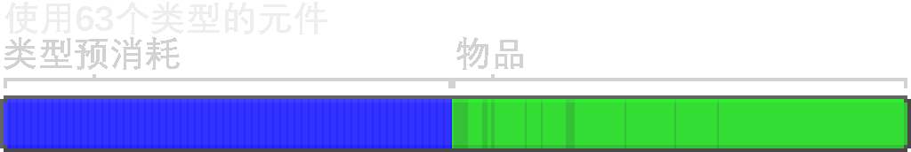

---
navigation:
  parent: ae2-mechanics/ae2-mechanics-index.md
  title: 字节和类型
  icon: creative_storage_cell
---

# 字节与类型

<Row>
    <ItemImage id="item_storage_cell_1k" scale="4" />

    <ItemImage id="item_storage_cell_4k" scale="4" />

    <ItemImage id="item_storage_cell_16k" scale="4" />

    <ItemImage id="item_storage_cell_64k" scale="4" />

    <ItemImage id="item_storage_cell_256k" scale="4" />
  </Row>

[存储单元](../items-blocks-machines/storage_cells.md)由 *字节* 和 *类型* 共同定义。字节和你现实中的电脑一样，用来衡量一个存储单元中可存放“物品”的总量。类型则用来衡量一个存储单元中存放了多少种不同的东西。每一种类型都代表一种独特的物品，所以 4,096 个圆石算 1 种类型，但 16 把附有不同魔咒的剑则算 16 种类型。

每个存储元件都能存储固定数量的数据。每种类型都会预先占用一定数量的字节（具体数值取决于存储元件的大小），而每个物品会占用 1 bit 的存储空间，因此 8 个物品会占用 1 byte，而整整一组 64 个物品会占用 8 bytes，无论该物品在 ME网络之外原本能如何堆叠。例如，64 个相同的马鞍占用的空间并不会比 64 个石子更多。

再次说明，每种物品占 1 bit，因此 8 种物品等于 1 byte。对于流体存储元，则是每 byte 可存储 8 桶。

许多人抱怨存储元件能容纳的种类数量有限，但这是一项***必要的限制***。

存储元件会将数据存储在物品本身的 NBT 标签中，这使它们相当稳定。不过，这也意味着如果在一个存储元件中放入过多数据，就可能导致需要向玩家发送的数据量过大，从而产生类似原版 Minecraft 中“书籍封禁”的效果。

此外，系统中不同种类过多，也会增加分类和物品处理的负载。不过，这项限制实际上并没有那么苛刻。一个装满存储元件的 <ItemLink id="drive" /> 仓位可以容纳 630 种类型，只要你不去存放大量独特且不可堆叠的物品，这其实已经很多了。

因此，分类的存在就是为了“强烈劝阻”你把来自刷怪场、带有数百件随机耐久损耗的盔甲和工具直接塞进你的 ME system。每一件拥有独特耐久和附魔的盔甲都必须作为单独的条目存储，进而造成臃肿。建议在它们接触你的系统之前，先将这些物品从物流中筛除。

通常并不建议一开始就直奔顶级存储单元，因为这样会消耗更多资源，却不会获得额外的类型存储容量。这意味着，即使到了游戏后期，各种大小的存储单元依然都有用武之地，因为它们各有取舍。

下表比较了不同等级的存储元可存储的容量，以及其成本的大致估算。

## 存储元内容与成本

| 存储元件                                     |   字节 | 类型 | 每种类型字节数 | 赛特斯 | 红石 | 金 | 荧石 |
| ---------------------------------------- | ------: | ----: | -------------: | -----: | -------: | ---: | --------: |
| <ItemLink id="item_storage_cell_1k" />   |   1,024 |    63 |              8 |      4 |        5 |    1 |         0 |
| <ItemLink id="item_storage_cell_4k" />   |   4,096 |    63 |             32 |  14.25 |       20 |    3 |         0 |
| <ItemLink id="item_storage_cell_16k" />  |  16,384 |    63 |            128 |     45 |       61 |    9 |         4 |
| <ItemLink id="item_storage_cell_64k" />  |  65,536 |    63 |            512 | 137.25 |      184 |   27 |        16 |
| <ItemLink id="item_storage_cell_256k" /> | 262,144 |    63 |           2048 |    414 |      553 |   81 |        48 |

## 不同类型数量下的存储容量

类型的前期成本机制决定了：只存放 1 种类型的存储元件，其容量可以达到已用满全部 63 种类型的存储元件的 2 倍。

| 存储元件                                     | 使用 1 种类型时的总容量 | 使用 63 种类型时的总容量 |
| ---------------------------------------- | ----------------------------------------: | ------------------------------------------: |
| <ItemLink id="item_storage_cell_1k" />   |                                     8,128 |                                       4,160 |
| <ItemLink id="item_storage_cell_4k" />   |                                    32,512 |                                      16,640 |
| <ItemLink id="item_storage_cell_16k" />  |                                   130,048 |                                      66,560 |
| <ItemLink id="item_storage_cell_64k" />  |                                   520,192 |                                     266,240 |
| <ItemLink id="item_storage_cell_256k" /> |                                 2,080,768 |                                   1,064,960 |

