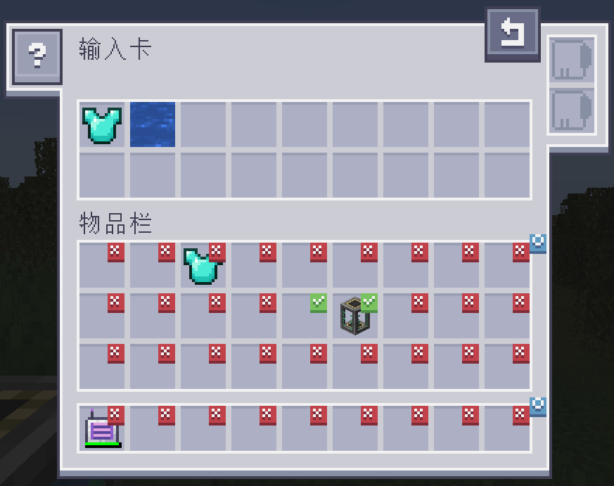
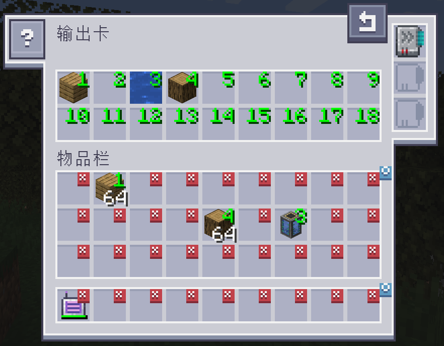

---
navigation:
  title: 附属：AE2输入输出卡
  icon: ae2importexportcard:export_card
  position: 150
categories:
- tools
item_ids:
- ae2importexportcard:export_card
- ae2importexportcard:import_card
---

# AE2输入输出卡

<Row>
  <ItemImage id="ae2importexportcard:export_card" scale="2" />

  <ItemImage id="ae2importexportcard:import_card" scale="2" />
</Row>

导入卡和导出卡可以让你从物品栏中导入/导出物品

## 输入卡

<ItemImage id="ae2importexportcard:import_card" scale="2" />

输入卡会将你物品栏中特定槽位里的物品取出，并放入你的 ME 系统中。

点击槽位会打上勾选标记。带有勾选标记的槽位中放置的任何物品都会被导入到你的 ME 系统中。将物品从你的物品栏拖到上方可更改过滤器。

### 升级

输入卡支持以下[升级](items-blocks-machines/upgrade_cards.md):

*   <ItemLink id="fuzzy_card" /> 按耐久值筛选和/或忽略物品 NBT
*   <ItemLink id="inverter_card" /> 将筛选器从白名单切换为黑名单

### 配方

<RecipeFor id="ae2importexportcard:import_card" />

## 输出卡

<ItemImage id="ae2importexportcard:export_card" scale="2" />

导出卡的工作方式完全相同，但它会将物品从你的 ME 系统拉取到你的物品栏中。

要指定哪些物品，请将物品从物品栏拖入顶部的某个槽位，然后点击你物品栏中的一个槽位，将其改成所需数量。右键单击可清除并恢复为 X。

### 升级

输出卡支持以下[升级](items-blocks-machines/upgrade_cards.md):

* <ItemLink id="fuzzy_card" /> 可按损耗值筛选和/或忽略物品 NBT
* <ItemLink id="speed_card" /> 将传输速度从 1 个提升到整整一组物品
* <ItemLink id="crafting_card" /> 会自动请求并合成当前不可用的物品

### 配方

<RecipeFor id="ae2importexportcard:export_card" />