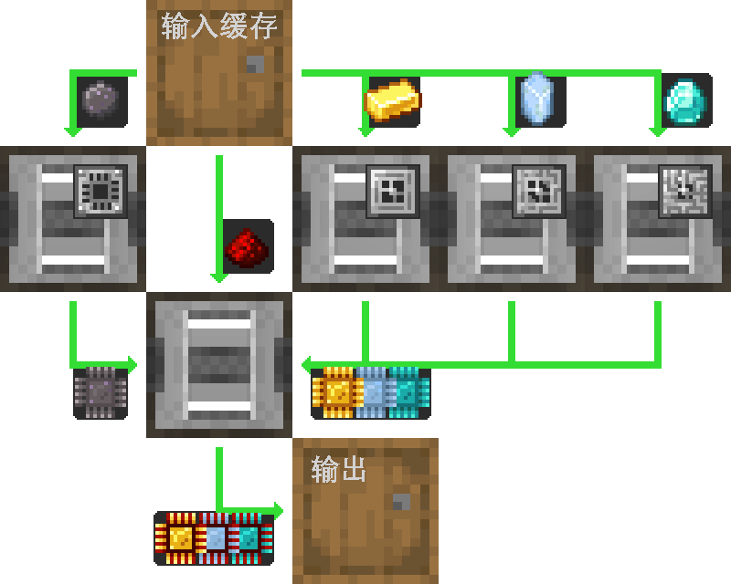

---
navigation:
  parent: example-setups/example-setups-index.md
  title: 处理器自动化
  icon: logic_processor
---

# 处理器生产自动化

有很多种自动化[处理器](../items-blocks-machines/processors.md)的方法，而这就是其中之一。

这种通用布局可以使用任何类型的物品物流管道、电路条、导管，或者该模组对它的其他称呼来实现，只要你能够对其进行过滤即可。

下面详细说明如何仅使用AE2和[“管道”子网络](pipe-subnet.md)来实现这一点。

请注意，由于这里使用了一个 <ItemLink id="pattern_provider" />，它旨在整合进你的[自动合成](../ae2-mechanics/autocrafting.md)
配置中。如果你只是想独立自动化处理器，请将样板供应器替换成另一个木桶，并直接把原料放入上方的木桶中。

这恰好与之前的 AE2 版本向后兼容，因为即使 <ItemLink id="inscriber" />s 有侧面区分，管道子网络仍会向正确的面插入并从正确的面提取。

## 样板编码课程

很多时候，你需要编码的[样板](../items-blocks-machines/patterns.md) **与 JEI 中显示的内容并不一致**，也和你点击 + 按钮时 JEI 输出的内容不同。  
在这种情况下，JEI 会输出 2 个分开的样板，一个用于已压印的组件，另一个用于最终组装，而已压印组件的样板会包含一个[压印模板](../items-blocks-machines/presses.md)。这并不是我们想要的，因为装置实际并不会这样运作。我们需要的是 1 个样板：输入原始资源，输出完成的处理器。既然压印模板已经在压印器里了，我们就不应该把它放进样板中。

---

<GameScene zoom="4" interactive={true}>
  <ImportStructure src="../assets/assemblies/processor_automation.snbt" />

<BoxAnnotation color="#dddddd" min="5 1 0" max="6 2 1" thickness=".05">
        (1) 样板供应器：在其默认配置下，配合相关的处理样板。

        <Row>
            
            
            
        </Row>
  </BoxAnnotation>

  <BoxAnnotation color="#dddddd" min="4.7 2 0" max="5 3 1" thickness=".05">
        (2) 存储总线 #1：使用默认配置。
  </BoxAnnotation>

<BoxAnnotation color="#dddddd" min="4 1 0" max="4.3 2 1" thickness=".05">
        (3) 输出总线 #1：过滤为硅，装有 2 张加速卡
        <Row><ItemImage id="silicon" scale="2" /> <ItemImage id="speed_card" scale="2" /></Row>
  </BoxAnnotation>

<BoxAnnotation color="#dddddd" min="4 4 0" max="4.3 3 1" thickness=".05">
        （4）输出总线 #2：已筛选为金锭，装有 2 张加速卡
        <Row><ItemImage id="minecraft:gold_ingot" scale="2" /> <ItemImage id="speed_card" scale="2" /></Row>
  </BoxAnnotation>

<BoxAnnotation color="#dddddd" min="4 5 0" max="4.3 4 1" thickness=".05">
        （5）输出总线 #3：已筛选为赛特斯石英晶体，装有 2 张加速卡
        <Row><ItemImage id="certus_quartz_crystal" scale="2" /> <ItemImage id="speed_card" scale="2" /></Row>
  </BoxAnnotation>

<BoxAnnotation color="#dddddd" min="4 6 0" max="4.3 5 1" thickness=".05">
        (6) 输出总线 #4：已过滤为钻石，装有 2 张加速卡
        <Row><ItemImage id="minecraft:diamond" scale="2" /> <ItemImage id="speed_card" scale="2" /></Row>
  </BoxAnnotation>

<BoxAnnotation color="#dddddd" min="2.3 3 0" max="2 2 1" thickness=".05">
        (7) 导出总线 #5：已过滤为红石粉，装有 2 张加速卡
        <Row><ItemImage id="minecraft:redstone" scale="2" /> <ItemImage id="speed_card" scale="2" /></Row>
  </BoxAnnotation>

<BoxAnnotation color="#dddddd" min="4 1 0" max="3 2 1" thickness=".05">
        (8) 1号压印器：处于默认配置。装有一个硅压印模板和 4 张加速卡
        <Row><ItemImage id="silicon_press" scale="2" /> <ItemImage id="speed_card" scale="2" /></Row>
  </BoxAnnotation>

<BoxAnnotation color="#dddddd" min="4 3 0" max="3 4 1" thickness=".05">
        (9) 压印器 #2：处于默认配置。装有一块逻辑压印模板和 4 张加速卡
        <Row><ItemImage id="logic_processor_press" scale="2" /> <ItemImage id="speed_card" scale="2" /></Row>
  </BoxAnnotation>

<BoxAnnotation color="#dddddd" min="4 4 0" max="3 5 1" thickness=".05">
        （10）压印器 #3：处于默认配置。装有一块计算压印模板和 4 张加速卡
        <Row><ItemImage id="calculation_processor_press" scale="2" /> <ItemImage id="speed_card" scale="2" /></Row>
  </BoxAnnotation>

<BoxAnnotation color="#dddddd" min="4 5 0" max="3 6 1" thickness=".05">
        （11）压印器 #4：处于默认配置。装有工程模板和 4 张加速卡
        <Row><ItemImage id="engineering_processor_press" scale="2" /> <ItemImage id="speed_card" scale="2" /></Row>
  </BoxAnnotation>

<BoxAnnotation color="#dddddd" min="2 2 0" max="1 3 1" thickness=".05">
        （12）压印器 #5：处于默认配置。装有 4 张加速卡
        <ItemImage id="speed_card" scale="2" />
  </BoxAnnotation>

<BoxAnnotation color="#dddddd" min="2.7 2 0" max="3 1 1" thickness=".05">
        （13）导入总线 #1：在默认配置下，装有 2 张加速卡
        <ItemImage id="speed_card" scale="2" />
  </BoxAnnotation>

<BoxAnnotation color="#dddddd" min="2.7 4 0" max="3 3 1" thickness=".05">
        (14) 输入总线 #2：在其默认配置下，带有 2 张加速卡
        <ItemImage id="speed_card" scale="2" />
  </BoxAnnotation>

<BoxAnnotation color="#dddddd" min="2.7 5 0" max="3 4 1" thickness=".05">
        （15）输入总线 #3：在默认配置下，装有 2 张加速卡
        <ItemImage id="speed_card" scale="2" />
  </BoxAnnotation>

<BoxAnnotation color="#dddddd" min="2.7 6 0" max="3 5 1" thickness=".05">
        (16) 输入总线 #4：在默认配置下，装有 2 张加速卡
        <ItemImage id="speed_card" scale="2" />
  </BoxAnnotation>

  <BoxAnnotation color="#dddddd" min="2 3 0" max="1 3.3 1" thickness=".05">
        (17) 存储总线 #2：使用默认配置。
  </BoxAnnotation>

  <BoxAnnotation color="#dddddd" min="2 1.7 0" max="1 2 1" thickness=".05">
        (18) 存储总线 #3：使用默认配置。
  </BoxAnnotation>

<BoxAnnotation color="#dddddd" min="1 2 0" max="0.7 3 1" thickness=".05">
        (19) 输入总线 #5：在其默认配置下，装有 2 张加速卡
        <ItemImage id="speed_card" scale="2" />
  </BoxAnnotation>

  <BoxAnnotation color="#dddddd" min="5 0.7 0" max="6 1 1" thickness=".05">
        (20) 存储总线 #4：使用默认配置。
  </BoxAnnotation>

<BoxAnnotation color="#dddddd" min="3.3 2.7 0.3" max="3.7 3 0.7" thickness=".05">
        石英纤维可为全部 3 台压印器供电，因为压印器会像线缆一样工作，因此能够传输能量
  </BoxAnnotation>

<DiamondAnnotation pos="7 1.5 0.5" color="#00ff00">
        连接到主网络
    </DiamondAnnotation>

  <IsometricCamera yaw="185" pitch="5" />
</GameScene>

## 配置

* <ItemLink id="pattern_provider" />（1）处于默认配置，并带有对应的 <ItemLink id="processing_pattern" />。
  请注意，这些样板是直接从原材料到成品处理器，**不**包含[压模](../items-blocks-machines/presses.md)。

  
  
  

* <ItemLink id="storage_bus" />（2、17、18、20）均处于默认配置。
* <ItemLink id="export_bus" />（3-7）已筛选为对应的材料。它们有 2 个 <ItemLink id="speed_card" />。
    <Row>
      <ItemImage id="silicon" scale="2" />
      <ItemImage id="minecraft:gold_ingot" scale="2" />
      <ItemImage id="certus_quartz_crystal" scale="2" />
      <ItemImage id="minecraft:diamond" scale="2" />
      <ItemImage id="minecraft:redstone" scale="2" />
    </Row>
* <ItemLink id="import_bus" />（13-16、19）均处于默认配置。它们有 2 个 <ItemLink id="speed_card" />。
* <ItemLink id="inscriber" />均处于默认配置。它们装有对应的[压印模具](../items-blocks-machines/presses.md)，
   以及 4 个 <ItemLink id="speed_card" />。
   <Row>
     <ItemImage id="silicon_press" scale="2" />
     <ItemImage id="logic_processor_press" scale="2" />
     <ItemImage id="calculation_processor_press" scale="2" />
     <ItemImage id="engineering_processor_press" scale="2" />
   </Row>

## 工作原理

1. <ItemLink id="pattern_provider" /> 会将材料推入桶中。
2. 第一个[管道子网](pipe-subnet.md)（橙色）会将硅、红石粉以及对应处理器的材料
   （金锭、赛特斯石英水晶或钻石）从桶中取出，并放入对应的 <ItemLink id="inscriber" /> 中。
3. 前四个 <ItemLink id="inscriber" /> 会制作 <ItemLink id="printed_silicon" />，以及 <ItemLink id="printed_logic_processor" />、
   <ItemLink id="printed_calculation_processor" /> 或 <ItemLink id="printed_engineering_processor" />。
4. 第二个和第三个[管道子网](pipe-subnet.md)（绿色）会将电路板从前四个 <ItemLink id="inscriber" /> 中取出
    并放入第五个，也是最后一个处理器集群 <ItemLink id="inscriber" /> 中。
5. 第五个 <ItemLink id="inscriber" /> 会组装[处理器](../items-blocks-machines/processors.md)。
6. 第四个[管道子网](pipe-subnet.md)（紫色）会将处理器放入样板供应器中，使其返回主网络。