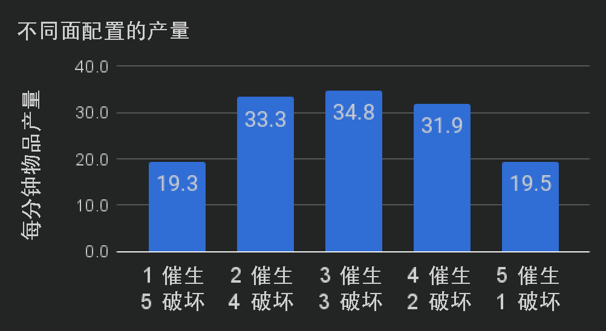
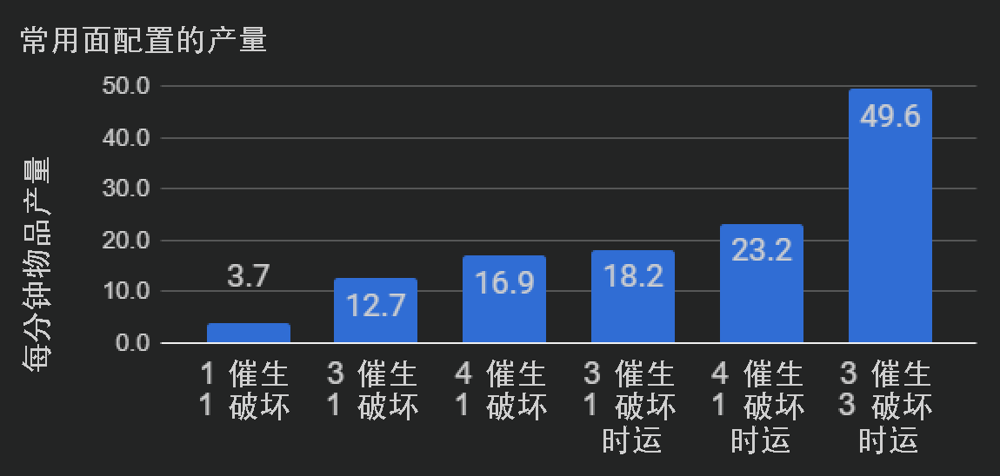

---
navigation:
  parent: ae2-mechanics/ae2-mechanics-index.md
  title: 赛特斯生长
  icon: quartz_cluster
---

# 赛特斯生长

## 基本上就是从入门页面直接复制粘贴过来的

<GameScene zoom="6" background="transparent">
<ImportStructure src="../assets/assemblies/budding_certus_1.snbt" />
</GameScene>

赛特斯石英芽会从[赛特斯石英母岩](../items-blocks-machines/budding_certus.md)上长出，类似于紫水晶。如果你打破一个尚未完全
长成的芽，它会掉落一个<ItemLink id="certus_quartz_dust" />，且不会受到时运影响。如果你打破一个完全长成的晶簇，它会掉落四个
<ItemLink id="certus_quartz_crystal" />，并且时运会提高这个数量。

赛特斯石英母岩共有 4 个等级：无瑕、有瑕、开裂和损坏，而你最初会在[陨石](../ae2-mechanics/meteorites.md)中找到它们。

<GameScene zoom="4" background="transparent">
  <ImportStructure src="../assets/assemblies/budding_blocks.snbt" />
  <IsometricCamera yaw="195" pitch="30" />
</GameScene>

每当晶芽生长到下一阶段时，母岩都有概率降一级，最终变成普通的赛特斯石英方块。你可以通过将母岩（或赛特斯石英方块）与一个或多个 <ItemLink id="charged_certus_quartz_crystal" /> 一同丢入水中来修复它们（并制造新的母岩）。

<RecipeFor id="damaged_budding_quartz" />

无瑕的赛特斯石英母岩不会退化，并且会无限生成赛特斯石英。不过它们无法被合成，也不能用镐子移动，即使附有精准采集也不行。（不过它们*可以*通过[封闭空间](../ae2-mechanics/spatial-io.md)来移动）

仅靠自身，赛特斯石英芽的生长速度非常缓慢。幸运的是，将 <ItemLink id="growth_accelerator" /> 放置在发芽方块旁边时，可以大幅加快这一过程。你应该优先先建造几个这样的装置。

<GameScene zoom="4" background="transparent">
  <ImportStructure src="../assets/assemblies/budding_certus_2.snbt" />
  <IsometricCamera yaw="195" pitch="30" />
</GameScene>

复杂交互意味着，母岩上每个被遮挡的面都会降低来自该母岩的累计生长速率，
最终这种影响会盖过增加更多加速器所带来的效果。经验测试结果如下：

如果你的石英不够再制作一个 <ItemLink id="energy_acceptor" /> 或 <ItemLink id="vibration_chamber" />，
你可以先做一个 <ItemLink id="crank" />，然后把它接在线圈加速器的末端。

如何自动收获赛特斯晶体已在[此处说明](../example-setups/simple-certus-farm.md)。